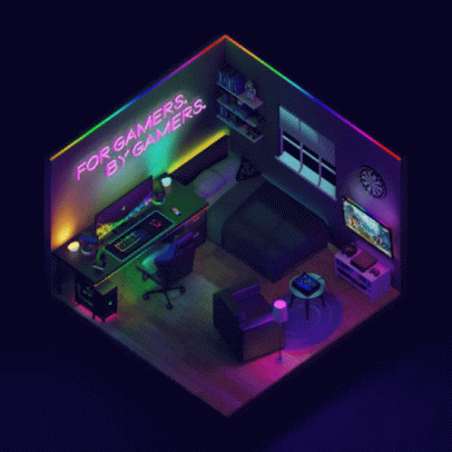
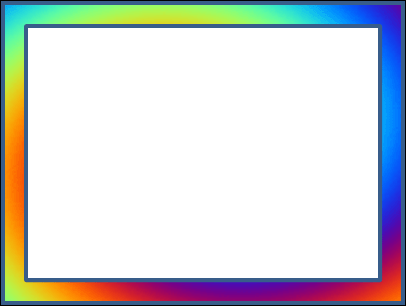

Pagina-Gamer
<!doctype html>
<html>
<head>
<meta charset="utf-8">
<title>Untitled Page</title>
<meta name="generator" content="WYSIWYG Web Builder 16 - http://www.wysiwygwebbuilder.com">
<link href="Juegos.css" rel="stylesheet">
<link href="Entrar.css" rel="stylesheet">

</head>
<body>

    

        
    

    <a id="Button1" href="./Bienvenida-.html" style="position:absolute;left:606px;top:842px;width:165px;height:65px;z-index:1;">GO!!</a>
    

        
    

    

        
    

</body>
</html>
